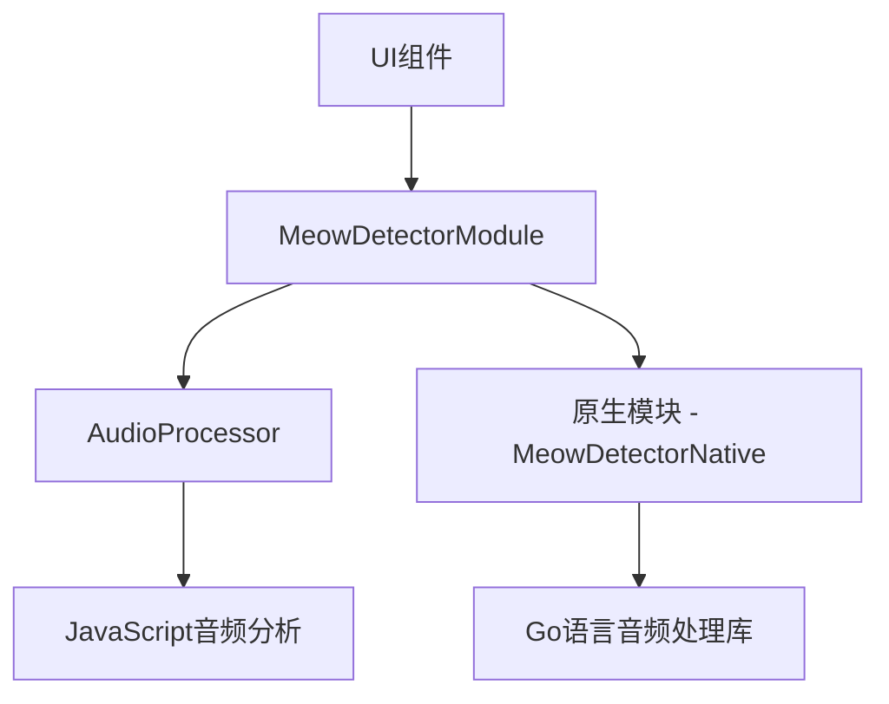
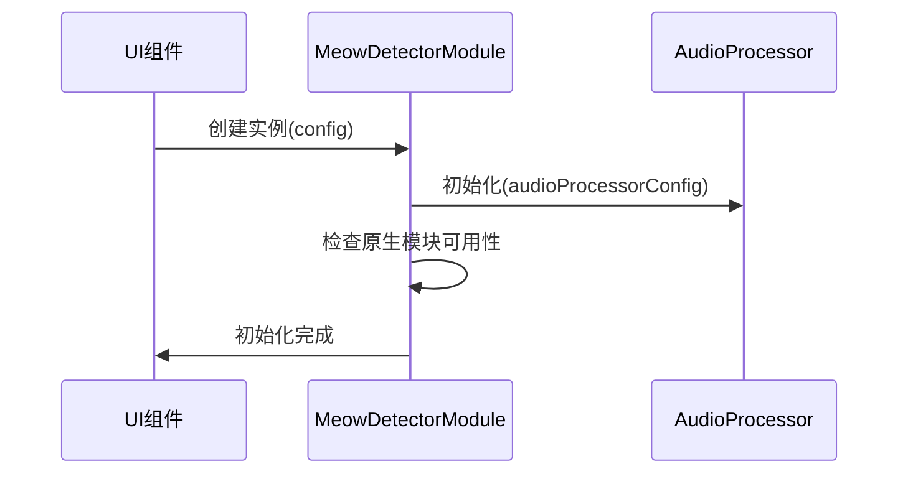
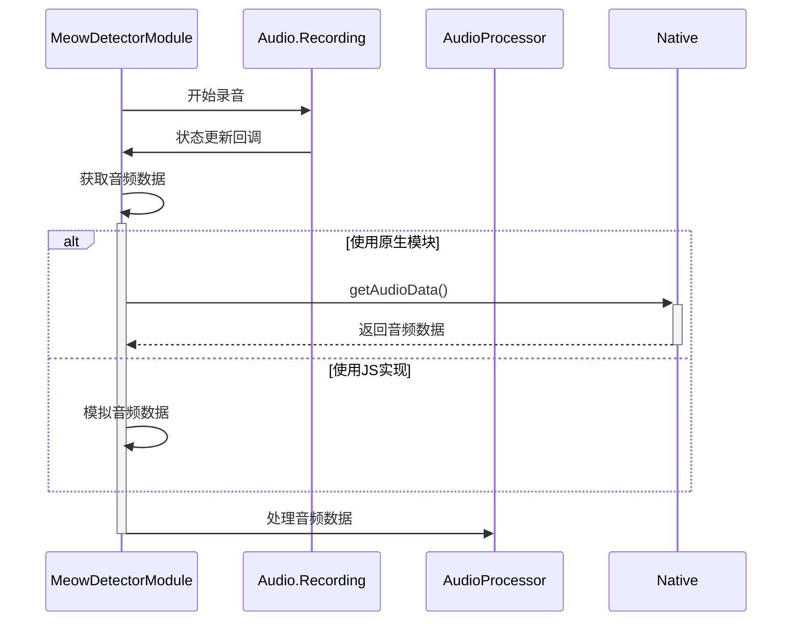
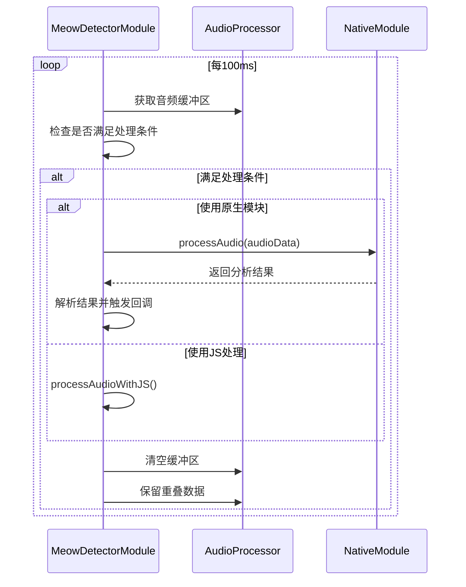

# 猫叫检测功能设计

## 功能概述

猫叫检测是MeowTalker系统的核心功能，负责实时监听环境声音，识别并提取猫叫声音，然后触发后续的分析流程。本模块采用高效的音频处理算法，结合自适应缓冲机制，实现准确的猫叫检测。

## 技术架构

猫叫检测功能采用多层架构设计，包括：

1. **接口层**：为应用提供简洁的API接口
2. **处理层**：实现音频数据处理和猫叫特征提取
3. **底层驱动**：通过原生模块高效处理音频数据

## 核心组件

### MeowDetectorModule

MeowDetectorModule是猫叫检测功能的主要入口，负责协调各个子组件的工作，管理音频录制和处理流程。

#### 主要职责

- 初始化音频会话和录音功能
- 管理音频缓冲区
- 协调原生模块与JavaScript处理逻辑
- 处理分析结果并触发回调
- 管理模块状态和生命周期

#### 状态管理

MeowDetectorModule定义了以下状态来管理整个检测流程：

- `Idle`: 空闲状态，尚未开始监听
- `Listening`: 正在监听环境声音
- `Recording`: 正在录制音频数据
- `Processing`: 正在处理音频数据
- `Detected`: 检测到猫叫声
- `Error`: 发生错误

**相关代码**：@src/sdk/MeowDetectorModule.ts#L15-L21

#### 配置选项

MeowDetectorModule支持以下配置选项：

- **百炼SDK配置**：用于语音识别的API配置
- **音频处理器配置**：
  - `sampleRate`：采样率
  - `silenceThreshold`：静默阈值
  - `minSilenceTime`：最小静默时间
  - `minProcessTime`：最小处理时间
  - `maxBufferTime`：最大缓冲时间
- **回调函数**：
  - `onStateChange`：状态变化回调
  - `onMeowDetected`：猫叫检测回调
  - `onAnalysisResult`：分析结果回调
  - `onError`：错误回调

**相关代码**：@src/sdk/MeowDetectorModule.ts#L26-L47

### AudioProcessor

AudioProcessor负责实际的音频处理工作，包括：

- 管理音频缓冲区
- 实现自适应缓冲机制
- 执行静默检测
- 提取音频特征

#### 缓冲区管理策略

1. **动态缓冲区**：根据音频特性动态调整缓冲区大小
2. **重叠窗口**：保留部分历史数据，确保连续分析
3. **强制处理触发**：当缓冲区数据达到阈值或超时时触发处理

**相关代码**：@src/sdk/MeowDetectorModule.ts#L265-L302

### 原生模块集成

为提高性能，系统使用原生模块处理音频数据：

- **Android平台**：使用JNI桥接调用Go语言音频处理库
- **其他平台**：回退到JavaScript实现

#### 原生模块通信流程

1. JavaScript层通过NativeModules调用原生方法
2. 原生层处理音频数据并返回结果
3. JavaScript层解析结果并触发相应回调

**相关代码**：@src/sdk/MeowDetectorModule.ts#L208-L263

## 猫叫检测算法

### 特征提取

系统从音频中提取以下关键特征：

- **能量特征**：表示音频信号的强度
- **频域特征**：通过FFT分析频谱分布
- **时域特征**：分析音频信号的时间变化模式

### 检测判断流程

1. **预处理**：对原始音频进行降噪和标准化
2. **特征提取**：计算能量、频谱等特征
3. **模式匹配**：对比特征与猫叫特征模型
4. **结果判断**：根据匹配度确定是否为猫叫

**相关代码**：@src/sdk/MeowDetectorModule.ts#L325-L390

## 关键流程详解

### 初始化流程

**相关代码**：@src/sdk/MeowDetectorModule.ts#L76-L100

### 音频采集流程

**相关代码**：@src/sdk/MeowDetectorModule.ts#L119-L148

### 音频处理流程

**相关代码**：@src/sdk/MeowDetectorModule.ts#L265-L323

## 性能优化策略

### 资源占用优化

1. **采样率优化**：使用4410Hz的采样率，降低处理负担同时保持有效分析
2. **缓冲区管理**：动态管理缓冲区大小，避免内存过度占用
3. **处理频率控制**：通过条件触发机制减少不必要的处理

### 准确率优化

1. **噪声过滤**：通过能量阈值和频谱分析过滤环境噪声
2. **特征匹配优化**：结合多种特征提高识别准确率
3. **自适应阈值**：根据环境噪声动态调整检测阈值

## 跨平台适配

猫叫检测模块针对不同平台做了特定适配：

- **Android**：使用原生模块和JNI桥接
- **iOS**：配置特定的音频会话参数
- **Web**：使用Web Audio API采集音频

**相关代码**：@src/sdk/MeowDetectorModule.ts#L161-L192

## 与其他模块交互

猫叫检测模块与以下组件交互：

1. **VideoAITransNative组件**：接收猫叫事件并触发图像捕获
2. **MoonShotService**：将猫叫结果和图像发送给AI分析服务
3. **AudioDataManager**：管理全局音频数据

## 未来扩展方向

1. **离线模型支持**：添加本地猫叫模型，减少网络依赖
2. **多猫识别**：区分不同猫咪的叫声特征
3. **情感预分析**：在本地进行初步的情感分类
4. **自适应学习**：根据用户反馈优化检测模型
