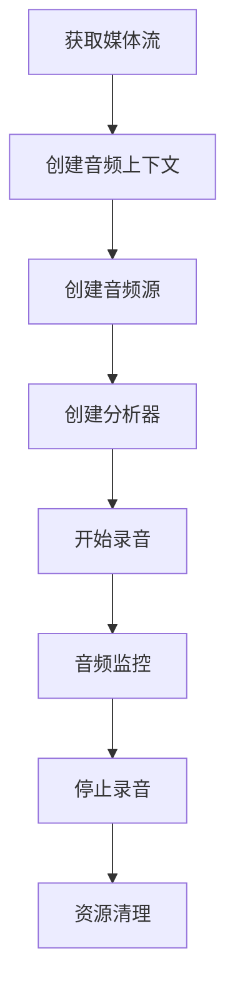

# Web Audio 录音流程文档

## 1. 音频流程概述



## 2. 音频流创建和初始化

### 2.1 获取媒体流
```typescript
const stream = await navigator.mediaDevices.getUserMedia({ 
  audio: {
    echoCancellation: true,    // 回声消除
    noiseSuppression: true,    // 噪声抑制
    autoGainControl: true      // 自动增益控制
  } 
});
```

### 2.2 创建音频上下文和分析器
```typescript
// 创建音频上下文
const audioContext = new AudioContext();

// 创建音频源
const source = audioContext.createMediaStreamSource(stream);

// 创建分析器
const analyser = audioContext.createAnalyser();
analyser.fftSize = 2048;  // 设置FFT大小
source.connect(analyser); // 连接音频源到分析器
```

## 3. 音频数据获取和监控

### 3.1 音量数据获取
```typescript
const getVolume = () => {
  const dataArray = new Uint8Array(analyser.frequencyBinCount);
  analyser.getByteFrequencyData(dataArray);
  
  // 计算平均音量
  const average = dataArray.reduce((acc, val) => acc + val, 0) / dataArray.length;
  return average / 255; // 归一化到 0-1
};
```

### 3.2 音频监控循环
```typescript
const startMonitoring = (startTime: number) => {
  if (!isRecording || !analyser) return;

  const volume = getVolume();
  
  // 处理音频数据
  onAudioData?.({
    metering: volume,
    isRecording: true,
    durationMillis: Date.now() - startTime
  });

  // 继续监控
  requestAnimationFrame(() => startMonitoring(startTime));
};
```

## 4. 录音控制

### 4.1 开始录音
```typescript
const startRecording = async () => {
  const stream = await navigator.mediaDevices.getUserMedia({ audio: true });
  const recorder = new MediaRecorder(stream);
  
  // 设置录音状态和通知父组件
  recorder.onstart = () => {
    setIsRecording(true);
    onRecordingState?.(true);
  };
  
  recorder.ondataavailable = (event) => {
    if (event.data.size > 0) {
      audioChunks.push(event.data);
    }
  };
  
  recorder.start(100);
};
```

### 4.2 停止录音
```typescript
const stopRecording = () => {
  if (!mediaRecorder || !isRecording) return;

  try {
    // 1. 停止所有音轨
    mediaRecorder.stream.getTracks().forEach(track => {
      track.stop();
    });

    // 2. 停止 MediaRecorder
    mediaRecorder.stop();
    
    // 3. 关闭音频上下文
    audioContext?.close();
    
    // 4. 更新状态和通知父组件
    setIsRecording(false);
    onRecordingState?.(false);
    
    // 5. 清理资源
    setAudioContext(null);
    setAnalyser(null);
    setMediaRecorder(null);
  } catch (error) {
    console.error('停止录音时出错:', error);
    // 确保状态重置和通知父组件
    setIsRecording(false);
    onRecordingState?.(false);
  }
};
```

## 5. 状态管理

### 5.1 组件状态同步
```typescript
// 子组件 (AudioRecorder)
const [isRecording, setIsRecording] = useState(false);

// 父组件 (TestAudioPage)
const [isRecording, setIsRecording] = useState(false);
const handleRecordingStateChange = (recording: boolean) => {
  setIsRecording(recording);
  if (!recording) {
    setAudioData(null);
  }
};
```

### 5.2 音频数据同步
```typescript
// 子组件发送数据
onAudioData?.({
  metering: volume,
  isRecording: true,
  durationMillis: Date.now() - startTime,
  isDoneRecording: false
});

// 父组件接收数据
const handleAudioData = (data: any) => {
  if (isRecording) {
    setAudioData(data);
    // 处理音频数据...
  }
};
```

## 6. 资源清理顺序

1. 停止录音时的清理顺序：
   - 更新录音状态 (`setIsRecording(false)`)
   - 停止 MediaRecorder
   - 停止音频轨道
   - 关闭音频上下文
   - 清理状态变量

2. 组件卸载时的清理：
   ```typescript
   useEffect(() => {
     return () => {
       // 停止录音
       mediaRecorder?.stop();
       // 停止所有轨道
       mediaRecorder?.stream.getTracks().forEach(track => track.stop());
       // 关闭音频上下文
       audioContext?.close();
     };
   }, []);
   ```

## 7. 错误处理

```typescript
try {
  await startRecording();
} catch (error) {
  console.error('录音错误:', error);
  // 清理资源
  stopRecording();
  // 通知上层
  onError?.(error);
}
```

## 8. 调试信息

### 8.1 音频状态日志
```typescript
console.log('音频状态:', {
  isRecording,
  hasMediaRecorder: !!mediaRecorder,
  hasAudioContext: !!audioContext,
  hasAnalyser: !!analyser,
  streamActive: mediaRecorder?.stream.active
});
```

### 8.2 音频数据日志
```typescript
console.log('音频数据:', {
  volume,
  frequencyBinCount: analyser.frequencyBinCount,
  sampleRate: audioContext.sampleRate,
  currentTime: audioContext.currentTime
});
```

## 9. 注意事项

1. **资源管理**
   - 确保在组件卸载时清理所有资源
   - 按正确顺序关闭音频流和上下文
   - 避免内存泄漏

2. **状态同步**
   - 使用 useRef 跟踪实时状态
   - 确保状态更新和资源清理的同步

3. **性能优化**
   - 合理设置 FFT 大小
   - 优化音量计算频率
   - 避免不必要的状态更新

4. **兼容性**
   - 检查浏览器支持
   - 处理权限请求失败
   - 提供降级方案

## 10. 常见问题

1. **音频流未正确关闭**
   - 检查清理顺序
   - 确保所有轨道都已停止
   - 验证音频上下文状态

2. **内存泄漏**
   - 使用 Chrome 开发工具监控内存
   - 检查 useEffect 清理函数
   - 验证所有监听器已移除

3. **性能问题**
   - 减少不必要的状态更新
   - 优化音频数据处理
   - 使用 Web Worker 处理复杂计算 